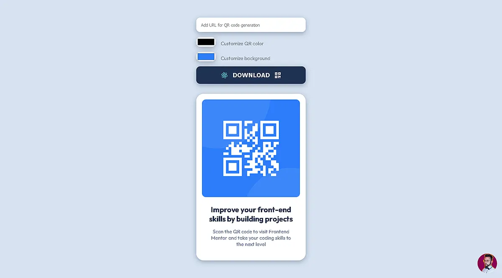

# QR Code Generator component - Frontend Mentor

This challenge was to build the QR Code component, but it has become something more complex than a simple component!  
Inspired by another project, I also wanted to add features to this challenge:
- On load, it shows the default basic QR Code
- Added a form that allows the user to enter a website URL to generate a QR Code for it
- Dynamically update the QR Code as you type the URL
- Dynamically update the color and background of the QR Code based on the customization input entered by the user
- When the form is sent, the `.png` of the generated QR Code is downloaded 
  
This is a evolved solution to the [QR code component challenge on Frontend Mentor](https://www.frontendmentor.io/challenges/qr-code-component-iux_sIO_H).

## Table of contents

- [Overview](#overview)
  - [Screenshot](#screenshot)
  - [Links](#links)
- [My process](#my-process)
  - [Built with](#built-with)
  - [What I learned](#what-i-learned)
  - [Continued development](#continued-development)
  - [Useful resources](#useful-resources)
- [Author](#author)

## Overview

### Screenshot

### Links

- Solution URL: [github](https://github.com/denielden/react-qrcode-generator)
- Live Site URL: [live site](https://denielden.github.io/react-qrcode-generator)

## My process

### Built with

- Semantic HTML5 markup
- CSS custom properties
- Flexbox
- Mobile-first workflow
- [React](https://reactjs.org/) - JS library
- [QRCode.react](https://www.npmjs.com/package/qrcode.react) - For QR Code

### What I learned

With this challenge I had the opportunity to learn and deepen:
- the use and manipulation of `QRCode.react`
- the correct use of `Refs` in react
- how the html `canvas` element works behind the scenes

I am eager to further evolve this project and learn much more!

### Continued development

Add new features:
- Insert custom image inside the QR Code
- Choose the format of the image to download 
- Connect with serverless database
- SignIn/Login
- Save the QR Code generated

### Useful resources

- [React Refs](https://it.reactjs.org/docs/refs-and-the-dom.html)
- [QRCode.react](https://www.npmjs.com/package/qrcode.react)

## Author

- Website - [denielden](https://denielden.github.io)
- Frontend Mentor - [@denielden](https://www.frontendmentor.io/profile/denielden)

  
Special thanks to @Remus432, he have really inspired me to create this dinamic component!  
Thank you for taking the time to check out my project!

## **Have fun building!** 🚀